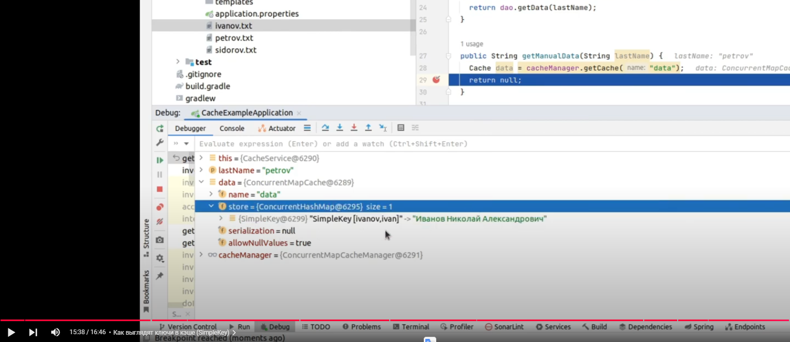

# Youtube

[JAVA SPRING CACHE: ОСНОВЫ КЭШИРОВАНИЯ ЗА 16 МИНУТ](https://www.youtube.com/watch?v=cFtkFQCo7-A)

https://github.com/dispikerton/cacheExample

Пример того что ключ если не указывать составной

