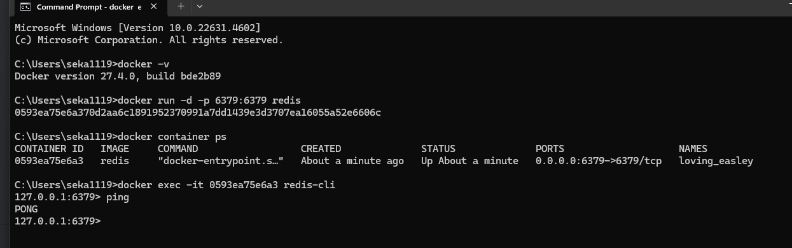
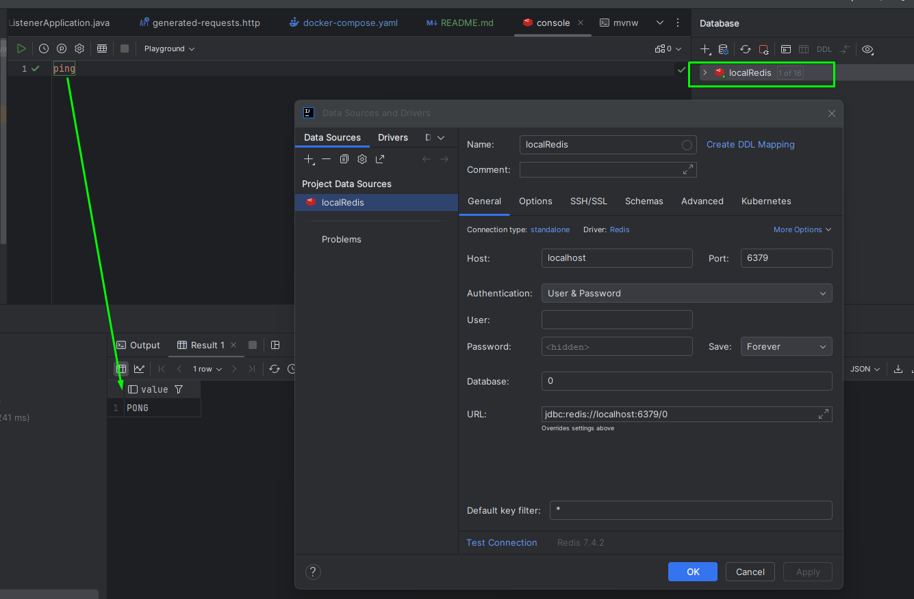
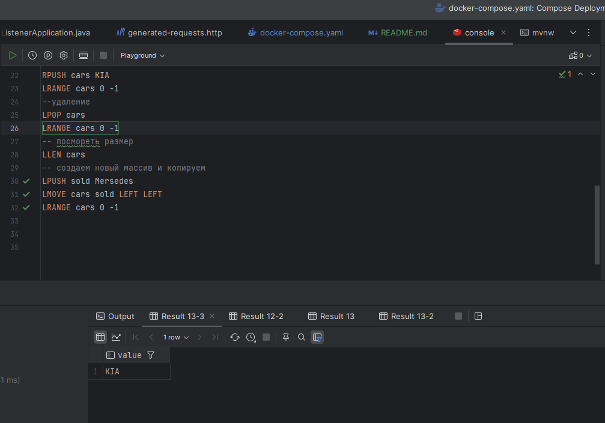
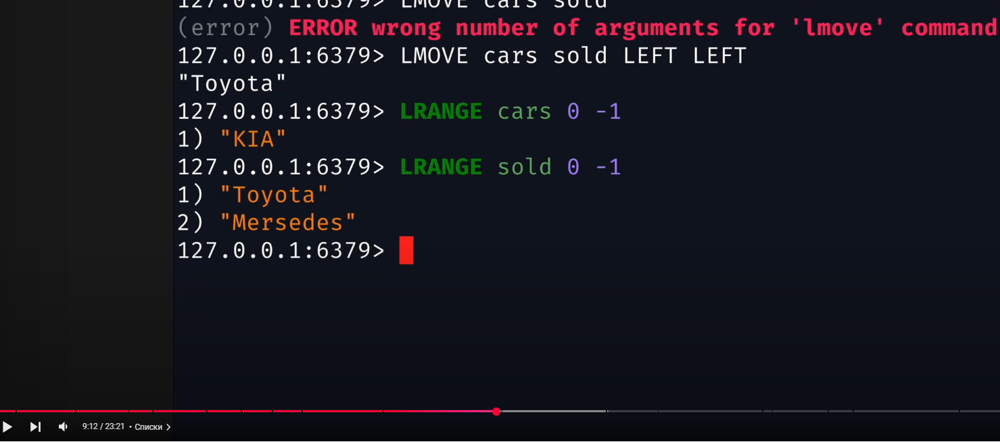
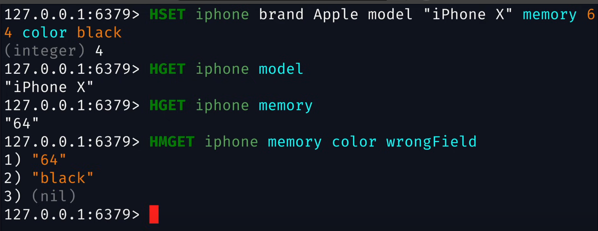
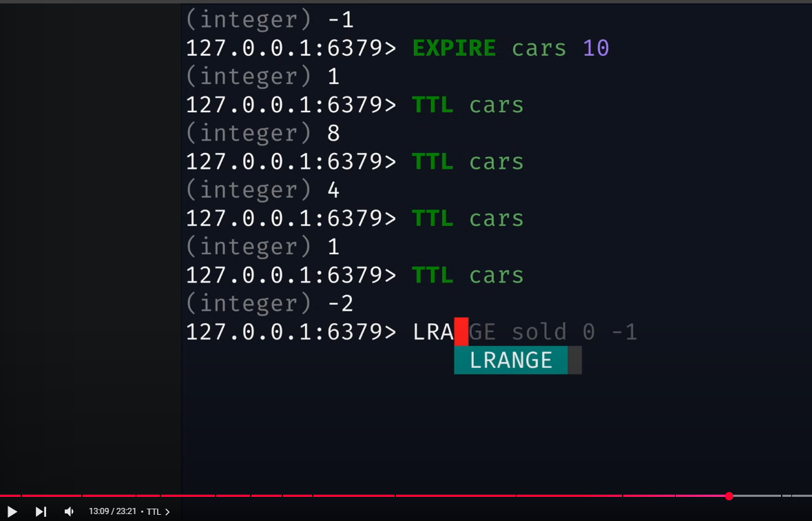

# docker

```bash
docker run -d -p 6379:6379 redis
docker container ps
docker exec -it 0593ea75e6a3 redis-cli
ping
```


https://redis.io/docs/latest/operate/oss_and_stack/install/install-redis/install-redis-on-windows/

```bash
SET firstKey "Hello"
SET secondKey "World"
GET firstKey
GET secondKey

```

[Redis за 20 минут](https://www.youtube.com/watch?v=QpBaA6B1U90&t=2s)

Примеры команд
```redis
SET firstKey "Hello"
SET secondKey "World"
GET firstKey
GET secondKey

-- test
DEL secondKey
GET secondKey

--
KEYS *

-- integer
SET num 1
INCRBY num 3
GET num

--списки
--добавление
LPUSH cars Toyota
LPUSH cars BMW
RPUSH cars KIA
LRANGE cars 0 -1
--удаление
LPOP cars
LRANGE cars 0 -1
-- посмореть размер
LLEN cars
--
```




```redis
-- создаем новый массив и копируем
LPUSH sold Mersedes
LMOVE cars sold LEFT LEFT
LRANGE cars 0 -1
-- работа с объектом
HSET iphone brand Apple model "iPhone X" memory 64 color black
HGET iphone model
HGET iphone memory
-- когда несколько полей
HMGET iphone memory color wrongField
```


```redis
--TTL -1 значит бесконечно, -2 удалена
TTL cars
-- зададим время жизни
EXPIRE cars 10
TTL cars
LRANGE cars 0 -1
-- сразу в TTL
SETEX varWithTtl 20 10
GET varWithTtl
TTL varWithTtl
```
